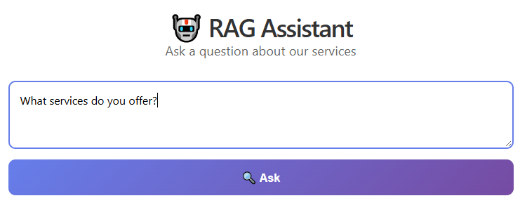
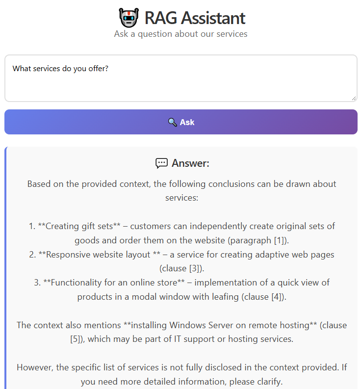
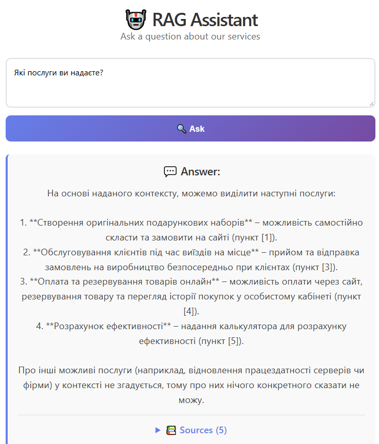
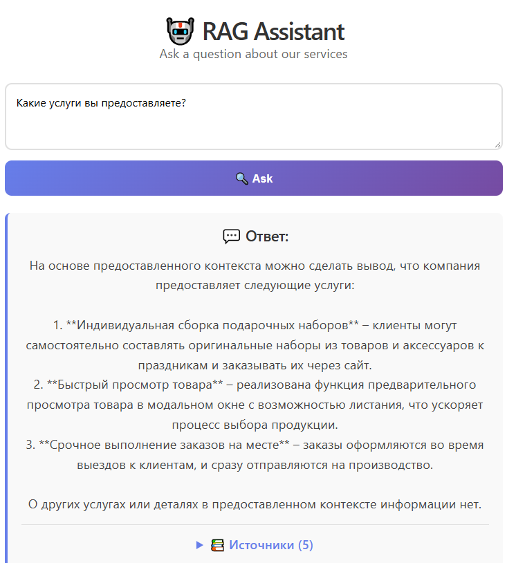
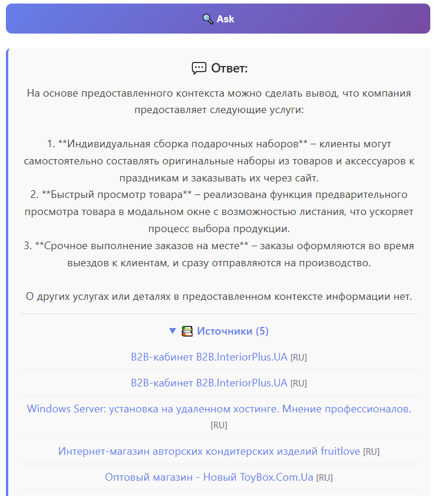
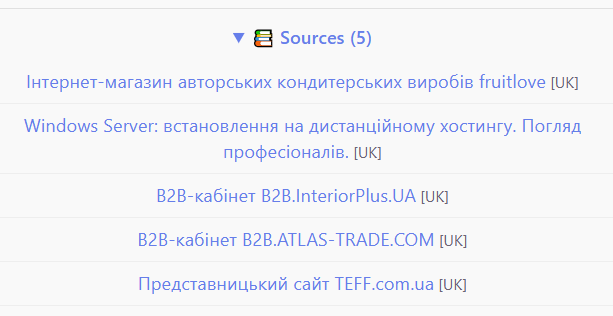

# Multilingual RAG System

A production-ready **Retrieval-Augmented Generation (RAG)** system that answers questions based on content scraped from a website. Supports **Russian**, **Ukrainian**, and **English** languages with automatic language detection and translation fallback.

## 🎯 Overview

This project implements a complete RAG pipeline from scratch:
- **Web scraping** — crawls a website and extracts clean text content
- **Vector storage** — stores document embeddings in ChromaDB with per-language collections
- **Semantic search** — finds the most relevant context for a user's question
- **LLM generation** — generates answers using Mistral API or local Ollama models
- **Multilingual support** — automatically detects question language and responds in the same language
- **Translation fallback** — if no content is found in the question's language, it translates the query and the answer

## ✨ Features

- 🌍 **Multilingual** — Russian, Ukrainian, and English with automatic detection
- 🔍 **Semantic search** — powered by sentence-transformers embeddings
- 📚 **Per-language collections** — separate ChromaDB collections for each language
- 🤖 **Dual LLM support** — Mistral API (cloud) and Ollama (local) for generation
- 🌐 **REST API** — FastAPI backend with auto-generated Swagger documentation
- 💻 **React frontend** — clean and simple chat interface
- 🔄 **Smart translation** — automatic fallback when content is missing in the target language
- 🕷️ **Smart crawler** — respects the website structure, avoids duplicates, and extracts main content

## 🏗️ Architecture
```
┌─────────────┐       ┌───────────────┐      ┌─────────────────┐
│ Website     │─────▶│ Crawler       │─────▶│ Text Chunks     │
│ (RU / UK)   │       │(BeautifulSoup)│      │ (500 chars each)│
└─────────────┘       └───────────────┘      └────────┬────────┘
                                                      │
                                                      ▼
┌─────────────┐       ┌──────────────┐       ┌─────────────────┐
│ React UI    │◀────▶│ FastAPI      │◀────▶│ ChromaDB        │
│             │       │ Backend      │       │(vector store)   │
└─────────────┘       └──────┬───────┘       └─────────────────┘
                             │
                             ▼
                      ┌──────────────┐
                      │ Mistral API  │
                      │ / Ollama     │
                      └──────────────┘

```

## 📸 Screenshots

### Main interface


### Answers




### Answer with sources



### Backend


## 🛠️ Tech Stack
```
| Component          | Technology                               |
|--------------------|------------------------------------------|
| Vector Database    | ChromaDB                                 |
| Embeddings         | sentence-transformers (all-MiniLM-L6-v2) |
| LLM (cloud)        | Mistral API                              |
| LLM (local)        | Ollama (qwen3:1.7b)                      |
| Backend            | FastAPI + Uvicorn                        |
| Frontend           | React + Vite                             |
| Crawling           | requests + BeautifulSoup                 |
| Language detection | langdetect                               |
| Translation        | MyMemory API                             |
```
## 🚀 Getting Started

### Prerequisites

- Python 3.10+
- Node.js 18+
- (Optional) [Ollama](https://ollama.ai/) for local LLM
- (Optional) [Mistral API key](https://console.mistral.ai/)

### Installation

1. **Clone the repository**
   ```bash
   git clone https://github.com/VitaliiVarshko/RAG-Assistant.git
   cd multilingual-rag

2. **Create a virtual environment**
python -m venv venv
# Windows
venv\Scripts\activate
# Linux/macOS
source venv/bin/activate

3. **Install Python dependencies**

bash
pip install -r requirements.txt

4. **Configure environment variables**

bash
cp .env.example .env
#Edit .env and add your MISTRAL_API_KEY

5. **Install frontend dependencies**

bash
cd frontend
npm install
cd ..

## Loading Data
Run the crawler to populate the database:

bash
python multi_lang_loader.py
This will:

Crawl the configured website (RU and UK versions)

Extract clean text

Split into chunks

Generate embeddings

Store in ChromaDB

## Running the Application

Terminal 1 — Backend:

bash
uvicorn backend.main:app --reload --host 127.0.0.1 --port 8000
Terminal 2 — Frontend:

bash
cd frontend
npm run dev
Open http://localhost:5173 in your browser.

## API Documentation
FastAPI auto-generates interactive docs:

Swagger UI: http://127.0.0.1:8000/docs

ReDoc: http://127.0.0.1:8000/redoc

## Example API Request
bash
curl -X POST http://127.0.0.1:8000/ask \
  -H "Content-Type: application/json" \
  -d '{"question": "What services do you offer?"}'
## 📁 Project Structure
```
multilingual-rag/
├── backend/
│   ├── main.py              # FastAPI application
│   └── models.py            # Pydantic models
├── frontend/                # React application
│   ├── src/
│   │   ├── App.jsx
│   │   └── App.css
│   └── package.json
├── chroma_db/               # Vector database (gitignored)
├── multi_lang_loader.py     # Crawler + data loader
├── multi_lang_qa.py         # RAG question-answering
├── config.py                # Configuration
├── site_config.py           # Website-specific settings
├── requirements.txt
├── .env.example
├── .gitignore
└── README.md
```
## 🔧 Configuration

## Adding a New Language
Edit config.py:

python
SUPPORTED_LANGUAGES = {
    "ru": {"name": "Russian", "collection": "documents_ru"},
    "uk": {"name": "Ukrainian", "collection": "documents_uk"},
    "en": {"name": "English", "collection": "documents_en"},  
}
## Switching LLM Provider
In the API request, change the generator field:

json
{
  "question": "Your question",
  "generator": "ollama",  // or "mistral"
  "model": "qwen3:1.7b"
}
## 🎓 What I Learned
This project demonstrates practical experience with:

Building a complete RAG pipeline from scratch

Vector databases and semantic search

Working with LLM APIs (Mistral) and local models (Ollama)

Multilingual NLP (language detection, translation)

Web scraping and content extraction

Building REST APIs with FastAPI

Creating a React SPA with Vite

Full-stack development and system design

## 🚧 Future Improvements
□ Streaming responses (token-by-token)
□ Chat history with context
□ User authentication
□ Docker containerization
□ Deployment to cloud (Vercel + Railway)
□ Hybrid search (semantic + keyword)
□ Support for PDF/DOCX documents
□ Reranking with cross-encoders


## 📄 License
This project is open source and available under the MIT License.

## 👤 Author
Vitalii Varshko

GitHub: @VitaliiVarshko

⭐ If you find this project useful, please consider giving it a star!